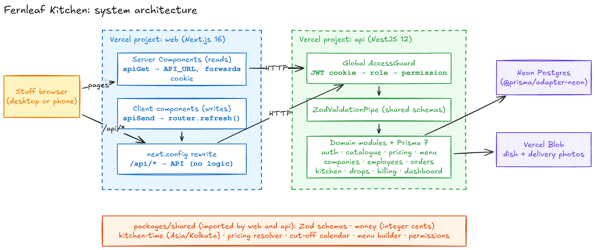
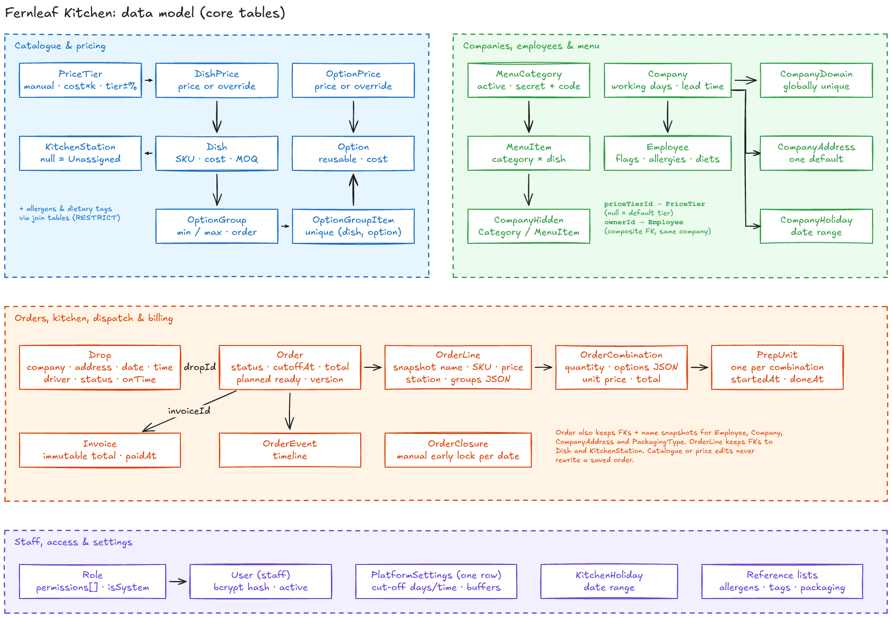
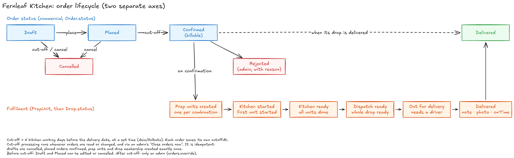

# Fernleaf Kitchen: Kitchen Operations Admin Panel

An internal admin panel for a commercial kitchen that runs corporate meal programmes. Companies sign up, their employees order boxed meals for specific delivery dates, and the kitchen cooks, packs and delivers them. Every order is billed to the employee's company. Staff (Admin, Kitchen, Dispatch, Driver) run the whole workflow from one panel: catalogue, pricing, menus, orders and cut-offs, the kitchen board, dispatch and driver delivery, invoicing, and a dashboard for each role.

- **Live app:** https://fernleaf-web.vercel.app
- **Stack:** Next.js 16 (web) · NestJS 12 (API) · Prisma 7 · PostgreSQL (Neon) · TypeScript throughout

| Role                         | Email             | Password  |
| ---------------------------- | ----------------- | --------- |
| Admin                        | admin@test.com    | Test@1234 |
| Kitchen                      | kitchen@test.com  | Test@1234 |
| Dispatch                     | dispatch@test.com | Test@1234 |
| Driver                       | driver@test.com   | Test@1234 |
| Order Desk (extra, optional) | orders@test.com   | Test@1234 |

Each account has only its own role's access, and the server enforces it. Order Desk is an extra least-privilege role for taking orders. It shows that a new role is only data (see [Roles and permissions](#roles-and-permissions)).

> **Time zone.** The kitchen runs on **Asia/Kolkata (IST, no daylight saving)**. Cut-offs, delivery dates, "today" and every time shown in the UI use kitchen time, whatever the server's or the browser's zone. **Currency** is USD, stored as integer cents.

---

## Contents

1. [Local setup](#local-setup)
2. [Architecture](#architecture)
3. [Data model](#data-model)
4. [Key decisions and trade-offs](#key-decisions-and-trade-offs)
5. [Dashboards](#dashboards)
6. [Prioritisation](#prioritisation)
7. [Ambiguous requirements and how I read them](#ambiguous-requirements-and-how-i-read-them)
8. [Testing](#testing)

---

## Local setup

**You need:** Node 22 (`.nvmrc`), pnpm (the repo pins `pnpm@12` through `packageManager`; `corepack enable` installs it), and either **Docker** (for the bundled local Postgres) or a Neon database.

Docker is used only for the local database. The apps run directly with `pnpm dev` and are deployed to Vercel without containers.

```bash
# 1. Install. This also builds packages/shared and generates the Prisma client.
pnpm install

# 2. Start the local database (PostgreSQL 17 on localhost:5432, data kept in a Docker volume)
docker compose up -d

# 3. Configure the API
cp apps/api/.env.example apps/api/.env
#   DATABASE_URL           already points at the Docker database; for Neon, use the pooled URL
#   DATABASE_URL_UNPOOLED  already points at the Docker database; for Neon, use the direct URL
#   JWT_SECRET             at least 32 random characters:
#                          node -e "console.log(require('crypto').randomBytes(48).toString('base64url'))"
#   BLOB_READ_WRITE_TOKEN  Vercel Blob token. Only needed to upload dish and delivery photos.

# 4. Configure the web app
cp apps/web/.env.example apps/web/.env.local   # API_URL=http://localhost:4000

# 5. Create the schema and seed realistic data (roles, the test accounts, menu, companies,
#    employees and orders in every status around today)
pnpm --filter @fernleaf/api db:deploy
pnpm --filter @fernleaf/api db:seed

# 6. Run everything (shared in watch mode, API on :4000, web on :3000)
pnpm dev
```

Open http://localhost:3000 and sign in with any account above. `docker compose down` stops the database and keeps its data; `docker compose down -v` also deletes the data.

**Checks** (all must pass before a commit):

```bash
pnpm format:check   # Prettier
pnpm lint           # ESLint (flat config; Next rules apply to apps/web only)
pnpm typecheck      # tsc in every package
pnpm test           # Vitest: 134 shared + 191 API tests
pnpm build          # shared → API → web
```

**Useful scripts**

| Command                                          | What it does                                                                                                                                                                                                              |
| ------------------------------------------------ | ------------------------------------------------------------------------------------------------------------------------------------------------------------------------------------------------------------------------- |
| `pnpm --filter @fernleaf/api db:seed`            | Idempotent base seed. Creates missing reference data, menu, companies and employees, and **restores the test accounts to `Test@1234`**. Don't run it against a database where staff accounts have been edited on purpose. |
| `pnpm --filter @fernleaf/api db:seed:demo`       | Adds only demo orders, drops and invoices around today. Never resets staff, configuration or existing orders.                                                                                                             |
| `pnpm --filter @fernleaf/api db:migrate`         | Creates a new migration in development (`migrate dev` + `generate`).                                                                                                                                                      |
| `pnpm exec next build --webpack` (in `apps/web`) | Fallback build if Turbopack's CSS worker can't open a socket in a restricted sandbox.                                                                                                                                     |

**Repository layout**

```
apps/
  web/        Next.js 16 App Router: pages, forms, boards. No business logic.
  api/        NestJS 12: one module per domain, Prisma schema, migrations and seed
packages/
  shared/     Zod schemas, types and pure business functions used by both sides
docs/diagrams/  Excalidraw sources (.excalidraw) and the PNGs used in this README
```

---

## Architecture



- **Two deployables, one repo.** A pnpm-workspaces monorepo holds `apps/web`, `apps/api` and `packages/shared`. There is no Turborepo: with three packages, `pnpm -r` already runs scripts in dependency order.
- **The frontend talks to the backend only over HTTP.** Server Components read through `apiGet` (`apps/web/src/lib/api/server.ts`), which calls the API at `API_URL` and forwards the session cookie. Client components write with `apiSend` to `/api/*`, then call `router.refresh()` to stream fresh server data. There are no Next.js server actions and no business logic in Next.
- **`/api/*` is a rewrite, not a proxy with logic.** `next.config.ts` forwards `/api/*` to Nest unchanged. The httpOnly auth cookie is therefore first-party (the two `vercel.app` subdomains count as different sites) and no CORS is needed.
- **NestJS has one module per domain:** auth, staff, roles, settings, reference, catalogue, pricing, menu, companies, employees, orders, kitchen, drops, billing, dashboard and demo. Every request passes the global `AccessGuard`. Inputs pass a `ZodValidationPipe` that uses the same schemas the forms use. Business errors are `ApiException`s with one shape: `{ code, message, fieldErrors? }`.
- **`packages/shared` is the single source of truth for rules that both sides need:** Zod schemas and types, integer-cent money helpers, kitchen-time helpers, the pricing resolver, the cut-off calendar, the menu builder and the permission list. The pure functions are unit-tested there and called by the API. The web app uses them only for display and early form feedback. The server always re-checks.
- **Storage:** Neon Postgres through Prisma 7's `@prisma/adapter-neon` (pooled URL at runtime, direct URL for migrations). A non-Neon URL, such as the local Docker database, uses `@prisma/adapter-pg` instead; `apps/api/src/prisma/adapter.ts` chooses by host name. Photos go to Vercel Blob, and the database stores only the URL.

---

## Data model



The full schema is in [`apps/api/prisma/schema.prisma`](apps/api/prisma/schema.prisma) (about 40 tables) and comments explain each model. These choices matter most:

| Concern                                         | How the model handles it                                                                                                                                                                                                                                                                                                                                                                                                                                   |
| ----------------------------------------------- | ---------------------------------------------------------------------------------------------------------------------------------------------------------------------------------------------------------------------------------------------------------------------------------------------------------------------------------------------------------------------------------------------------------------------------------------------------------- |
| **History never changes**                       | `OrderLine` and `OrderCombination` copy the dish name, SKU, station, prices, chosen options and group rules at the time of ordering. The option and group details are JSON snapshots; the amounts, quantities, status and dates are real columns. They also keep FKs to `Dish` and `KitchenStation` for reporting. Editing the catalogue or prices never rewrites a saved order.                                                                           |
| **Money**                                       | Every amount is an `Int` of cents. Tier rules are integer basis points (2.4 → `24000`, +15% → `1500`). There are no floats anywhere.                                                                                                                                                                                                                                                                                                                       |
| **Derived prices**                              | `PriceTier.rule` is `MANUAL`, `COST_MULTIPLIER` or `TIER_PERCENT`, with a CHECK that each rule has exactly its own fields. `DishPrice` and `OptionPrice` store only typed prices: manual prices, or overrides on a derived tier. Derived prices are **computed when read** by the shared resolver, so they can't go stale. A partial unique index allows exactly one default tier.                                                                         |
| **Integrity in the database, not only the app** | Company domains are globally unique and lowercase (CHECK). Each company has one default address (partial unique index). The company owner must be one of its own employees (composite FK `(ownerId, id) → employees(id, companyId)`). An option appears only once per dish (`unique(dishId, optionId)`). Reference data in use can't be deleted (`ON DELETE RESTRICT`), so it is deactivated instead. Platform settings are a single row (CHECK `id = 1`). |
| **Two lifecycles**                              | `Order.status` is the commercial state (Draft → Placed → Confirmed → Delivered, plus Cancelled and Rejected). Fulfilment is tracked separately by `PrepUnit` timestamps and `Drop.status`. See the diagram below.                                                                                                                                                                                                                                          |
| **Prep units**                                  | One `PrepUnit` per `OrderCombination`, created atomically when the order is confirmed. Each is routed to the line's saved station, or to Unassigned.                                                                                                                                                                                                                                                                                                       |
| **Drops**                                       | A stored `Drop`, unique on `(company, address, date, time)`, holds the driver, the status, the delivery note, the photo and `onTime`. Orders join a drop when confirmed. Cancelled orders leave it, and empty drops are removed.                                                                                                                                                                                                                           |
| **Billing**                                     | `Order.invoiceId` is a single nullable FK, so an order can be on at most one invoice by construction. Invoices store their totals and billing-contact snapshots. Database triggers back up the rule that issued amounts and membership never change.                                                                                                                                                                                                       |
| **Concurrency**                                 | `Order`, `Drop` and `Invoice` carry a `version` for optimistic checks. Critical writes run in Serializable transactions or under `SELECT … FOR UPDATE` row locks (see below).                                                                                                                                                                                                                                                                              |
| **Timeline**                                    | `OrderEvent` is the order's own history (created, placed, confirmed, overrides with old → new values, kitchen and dispatch steps, delivered on time or late, invoiced, paid). It is not a general audit log, which the brief puts out of scope.                                                                                                                                                                                                            |
| **Time**                                        | Instants are `timestamptz` in UTC. Delivery dates and holidays are `DATE`. Delivery and cut-off times are wall-clock minutes in kitchen time (750 = 12:30).                                                                                                                                                                                                                                                                                                |

### Order lifecycle



The diagrams are drawn in Excalidraw. To edit one, open the `.excalidraw` file in `docs/diagrams/` at https://excalidraw.com and export the PNG again.

---

## Key decisions and trade-offs

| Area               | Decision                                                                                                                                                    | Why / trade-off                                                                                                                                                                                                                                                                                                       |
| ------------------ | ----------------------------------------------------------------------------------------------------------------------------------------------------------- | --------------------------------------------------------------------------------------------------------------------------------------------------------------------------------------------------------------------------------------------------------------------------------------------------------------------- |
| Repo               | pnpm monorepo, no Turborepo                                                                                                                                 | Shared types and schemas on both sides. One tool fewer to configure and defend.                                                                                                                                                                                                                                       |
| Validation         | Zod schemas in `packages/shared`, used by a Nest pipe and by react-hook-form's `zodResolver`                                                                | The same rules and the same `fieldErrors` path from the server error to the input. The server re-validates everything.                                                                                                                                                                                                |
| Auth               | Own bcrypt (`bcryptjs`) + JWT in an httpOnly, SameSite=Lax, Secure cookie, valid for 12 hours                                                               | Staff accounts are created by admins, so there's no sign-up flow and a third-party auth service isn't needed. The JWT holds only the user id. **Role and permissions are reloaded from the database on every request**, so deactivation or a role change applies immediately. Trade-off: one extra query per request. |
| Access control     | Global guard, **deny by default**: a route with no `@Public()`, `@SignedIn()` or `@RequirePermission()` returns 403                                         | Forgetting to protect a route fails closed.                                                                                                                                                                                                                                                                           |
| Data fetching      | Server Components + Suspense streaming; writes with `fetch` then `router.refresh()`; boards poll every 15–30 s while the tab is visible. No TanStack Query. | One pattern across the app and fewer tools. Trade-off: no client cache, and polling instead of push. That's fine for kitchen and dispatch boards.                                                                                                                                                                     |
| UI                 | Tailwind + shadcn/ui (Base UI), native `<select>`s, mobile-first driver view                                                                                | Accessible components. Native selects work well on phones.                                                                                                                                                                                                                                                            |
| Database           | Neon serverless Postgres                                                                                                                                    | Real Postgres with partial indexes, CHECKs, triggers and Serializable isolation, on a free tier that lasts the review window.                                                                                                                                                                                         |
| Local database     | `docker compose up -d` runs PostgreSQL 17 only; the apps run with `pnpm dev`                                                                                | No cloud account needed to run locally. Web and api aren't containerised because Vercel doesn't use containers.                                                                                                                                                                                                       |
| Dates and times    | Plain `Intl` with the zone always passed explicitly. No date library.                                                                                       | The same IANA data that Luxon or date-fns-tz use. Kolkata has no daylight saving, so wall-clock gaps don't arise. Tests pass the zone explicitly and include non-IST zones, so results never depend on the host's `TZ`.                                                                                               |
| Derived prices     | Computed when read, not stored                                                                                                                              | Always consistent with the base. The cost is a little CPU per read, which is negligible next to the database.                                                                                                                                                                                                         |
| Cut-off processing | Runs **lazily** (before any order read or write) plus **"Close orders now"** for admins                                                                     | The result is correct without depending on a scheduler. Free-tier crons run at most daily.                                                                                                                                                                                                                            |
| Files              | Vercel Blob, uploaded through Nest after an ownership check; photos compressed in the browser                                                               | The Vercel filesystem doesn't persist, and request bodies are limited to about 4.5 MB.                                                                                                                                                                                                                                |
| Testing            | Vitest. Pure business functions in `shared`; API tests boot the real Nest app on a random port and call it with `fetch`                                     | They test the same pipes, guards and filters as production, without supertest.                                                                                                                                                                                                                                        |
| TypeScript, ESLint | TS pinned to `~6.0`, ESLint 9                                                                                                                               | typescript-eslint and eslint-config-next don't support TS 7 or ESLint 10 yet.                                                                                                                                                                                                                                         |

### Roles and permissions

- Roles are **database rows** that hold a list of permission names (`Role.permissions text[]`). The permission list itself is code, in `packages/shared/src/permissions.ts`, because code is what checks it.
- Endpoints declare what they need, e.g. `@RequirePermission('kitchen.work')`. **Nothing in the code checks a role name.** Adding a role means opening Roles → New and ticking permissions, with no code change. The extra Order Desk account shows this.
- Admin is a locked system role that implicitly has every permission, including ones added later.
- Guard rails run in a Serializable transaction: you can't deactivate yourself or change your own role, and the last active admin can't be removed.
- Responses are trimmed by permission on the server. Kitchen and Dispatch get orders **without money**. Cost prices need `pricing.read`. Drivers can read only their own drops for today.

| Role       | Permissions (seeded)                                                              |
| ---------- | --------------------------------------------------------------------------------- |
| Admin      | all                                                                               |
| Kitchen    | `kitchen.view`, `kitchen.work`, `orders.read`, `catalogue.read`                   |
| Dispatch   | `dispatch.view`, `drops.assign`, `drops.advance`, `orders.read`, `companies.read` |
| Driver     | `deliveries.own`                                                                  |
| Order Desk | `orders.read`, `orders.readMoney`, `orders.write`                                 |

---

## Dashboards

Each user lands on `/`, and the server picks the dashboard **from permissions, not from the role name** (`dashboardKind` in `packages/shared/src/dashboard.ts`):
`billing.read` + `orders.readMoney` → Admin; otherwise `kitchen.view` → Kitchen; otherwise `dispatch.view` → Dispatch; otherwise `deliveries.own` → Driver; otherwise a general launcher.

These rules apply to every dashboard:

- **"Today"** is the current date in Asia/Kolkata, computed on the server. Orders are grouped by **delivery date** (not by creation date).
- Due cut-off processing runs before any figure is computed, so no number counts an order that should already have been confirmed or cancelled.
- Every figure aggregates the **whole scope** in SQL, never only the page you're looking at. Missing groups count as **0**, and empty sums count as **$0.00**.
- The page refreshes every 30 seconds while visible and shows an "as of" time.
- On a kitchen non-working day or holiday, a banner says the kitchen is closed and gives the next working date. I don't invent weekend work to fill the screen.

### Admin: "Is today on track, and what is the business owed?"

| Figure                            | Exact definition                                                                                                                                                                   |
| --------------------------------- | ---------------------------------------------------------------------------------------------------------------------------------------------------------------------------------- |
| Orders today by status            | Count of orders with `deliveryDate = today`, grouped by status. **All six statuses are shown separately, including Cancelled and Rejected**, so nothing disappears from the total. |
| Unpaid invoices: amount and count | Sum of `totalCents` and count of invoices with `paidAt` empty, **across all issue dates**. This is money owed now, not this month's billing.                                       |
| Invoices needing review           | Count of invoices (paid or unpaid) holding at least one order flagged after invoicing: cancelled, overridden or short-delivered.                                                   |

Why: an admin needs to see whether today's operation is healthy, how much is outstanding, and which issued invoices need a human decision. **Not shown:** revenue or profit charts, forecasts, rankings or trend lines. With a few weeks of demo data they would look impressive but mean little, and turning cost into profit needs decisions (cancelled orders, short deliveries) the brief doesn't settle.

### Kitchen: "What do I cook, where, and what's late?" (the 6 am view)

| Figure                   | Exact definition                                                                                                                                  |
| ------------------------ | ------------------------------------------------------------------------------------------------------------------------------------------------- |
| Per station: total units | Prep units of **confirmed** orders delivering today, grouped by the station saved on the unit. A unit with no station is shown as **Unassigned**. |
| Remaining                | total − done                                                                                                                                      |
| In progress              | started and not done                                                                                                                              |
| Late                     | not done **and** the order's planned kitchen-ready time is earlier than now                                                                       |
| At risk                  | not started **and** planned kitchen-ready falls between now and now + the at-risk setting (30 minutes by default), inclusive                      |
| Orders ready             | today's confirmed orders whose `kitchenReadyAt` is set (every unit done), including orders that have left but aren't yet delivered                |

These figures come from exactly the same SQL aggregate the kitchen board uses, so the dashboard and the board always agree. Delivered, cancelled and rejected orders are excluded. Active stations with no work show 0. An inactive station that still has work stays visible. Each station links to the board filtered to that station. **Not shown:** prices, costs, or per-cook productivity. The kitchen needs the workload, not the money, and Kitchen staff don't have money permissions.

### Dispatch: "Which drops can go, and which still need a driver?"

| Figure           | Exact definition                                                                                                                                                                                                                                                                                                              |
| ---------------- | ----------------------------------------------------------------------------------------------------------------------------------------------------------------------------------------------------------------------------------------------------------------------------------------------------------------------------- |
| Drops by stage   | Today's drops that contain **at least one order**, split into: _Waiting_ (stored WAITING with some order not yet kitchen-ready), _Kitchen ready_ (stored WAITING with **every** order confirmed and kitchen-ready; this stage is computed, not stored), _Dispatch ready_, _Out for delivery_ and _Delivered_ (stored states). |
| Unassigned drops | Today's non-empty drops that haven't left yet (Waiting or Dispatch ready) and have no driver                                                                                                                                                                                                                                  |

A drop is the unit dispatch works with, and the board lets you open each order inside a drop. **Not shown:** driver league tables or on-time percentages. Today's sample is too small for a percentage to be honest.

### Driver: "What's left on my run today?" (phone-first)

| Figure                   | Exact definition                                                                                                                       |
| ------------------------ | -------------------------------------------------------------------------------------------------------------------------------------- |
| Remaining                | **Only this driver's** non-empty drops for today that aren't delivered, including drops still waiting on the kitchen                   |
| Out                      | this driver's drops currently out for delivery                                                                                         |
| Delivered                | this driver's drops delivered today                                                                                                    |
| On time / late / unknown | delivered drops split by `onTime = true / false / not recorded`. Unknown is shown as its own number, never hidden inside a percentage. |

The dashboard figures cover today only. **My deliveries** has three tabs: **Today** (the default, in time order, with the "mark delivered" form), **Upcoming** (the next 14 days) and **Past** (the last 30 days, newest first, with delivered time, on time or late, note and photo). **Not shown:** other drivers' work or money.

### Order Desk / general

A launcher to create an order or browse orders. It doesn't invent metrics for a role that has no operational figures.

---

## Prioritisation

### What I built

Every **[Must]** in section 4 and the non-functional requirements in section 7: catalogue, menu, pricing, companies, employees, orders and cut-off, kitchen board, dispatch and driver view, billing, settings, dashboards, role-based access, integer money, IST time handling, concurrency safety, server-side pagination, and tests of the risky rules. From the **[Should]** items I built **employee CSV import** with row-level errors.

I built it module by module as vertical slices (API, shared rules and screens together). Each module is one commit in the history, from foundation and auth through to demo coverage.

---

## Ambiguous requirements and how I read them

| Requirement                                              | My interpretation                                                                                                                                                                                                                                                                                                                                                                                                                                                                                                                                                                                                    |
| -------------------------------------------------------- | -------------------------------------------------------------------------------------------------------------------------------------------------------------------------------------------------------------------------------------------------------------------------------------------------------------------------------------------------------------------------------------------------------------------------------------------------------------------------------------------------------------------------------------------------------------------------------------------------------------------- |
| Kitchen time zone and currency                           | Asia/Kolkata (the dishes are Indian; no daylight saving) and USD in integer cents (the brief uses `$`).                                                                                                                                                                                                                                                                                                                                                                                                                                                                                                              |
| Option group "choose" semantics                          | Every group has min/max choices: protein exactly 1, extras 0–3. Required means min ≥ 1. An option can't be chosen twice in one combination.                                                                                                                                                                                                                                                                                                                                                                                                                                                                          |
| Minimum order quantity                                   | Optional per dish, checked **per order line** when the order is placed (drafts may be below it).                                                                                                                                                                                                                                                                                                                                                                                                                                                                                                                     |
| "Secret" category in a staff-only panel                  | Not listed, but reachable with an admin-set **access code** in the preview and the order form. This is a sharing mechanism, not a security barrier, and admins can read the codes.                                                                                                                                                                                                                                                                                                                                                                                                                                   |
| Option with no price on the tier                         | Hidden. "Options free with a dish" are out of scope, so it can't be shown as $0. If that leaves a required group empty, the whole dish is hidden.                                                                                                                                                                                                                                                                                                                                                                                                                                                                    |
| Rounding derived prices                                  | Always **up** to the next 5¢, and an exact multiple is unchanged. Overrides are **not** rounded. Cost price is required, so `cost × k` always has a base.                                                                                                                                                                                                                                                                                                                                                                                                                                                            |
| Allergies and diets                                      | Shown as **warnings** in the preview and the order form ("Contains milk: Priya is allergic"), not as filters. Staff may still choose deliberately.                                                                                                                                                                                                                                                                                                                                                                                                                                                                   |
| Delivery date validity                                   | It must be a working day for **both** the kitchen and the company. Only the kitchen calendar moves the cut-off.                                                                                                                                                                                                                                                                                                                                                                                                                                                                                                      |
| Counting back working days                               | The delivery day itself doesn't count. Wednesday − 2 = Monday at the cut-off time. Kitchen holidays and non-working days are skipped.                                                                                                                                                                                                                                                                                                                                                                                                                                                                                |
| Settings changes and existing orders                     | Each order keeps the cut-off it was given. Changes affect new orders only, so no order's lock moves under it.                                                                                                                                                                                                                                                                                                                                                                                                                                                                                                        |
| Automatic vs manual cut-off processing                   | Both. It runs automatically on access, and "Close orders now" works for any date: past dates are processed, and future dates are locked early through a stored closure.                                                                                                                                                                                                                                                                                                                                                                                                                                              |
| Rejected vs Cancelled                                    | Cancelled = withdrawn (by staff before cut-off, or a draft at cut-off). Rejected = an admin refuses a placed or confirmed order the kitchen can't fulfil, with a required reason. Neither is billable unless it was already invoiced (see billing policy).                                                                                                                                                                                                                                                                                                                                                           |
| Order status vs fulfilment steps (both have "delivered") | Two separate axes. The order becomes Delivered automatically when its drop is delivered.                                                                                                                                                                                                                                                                                                                                                                                                                                                                                                                             |
| Admin "can override anything"                            | Admins may edit lines after confirmation until the kitchen starts the order (changed lines use current prices; untouched lines keep their snapshot). They may change time, address and packaging until out for delivery, and may bypass the employee's address/time/packaging flags when ordering. Only the assigned driver can record a delivery, because admins don't impersonate drivers.                                                                                                                                                                                                                         |
| One order per employee per day                           | At most one open order per employee per delivery date, since the brief has no meal slots. This prevents double cooking and double billing.                                                                                                                                                                                                                                                                                                                                                                                                                                                                           |
| When prep units exist                                    | On confirmation, one per distinct combination. Before that, the order can still change.                                                                                                                                                                                                                                                                                                                                                                                                                                                                                                                              |
| Late and at risk                                         | Late = not done and past planned kitchen-ready. At risk = not started and within a configurable window (default 30 minutes). The 30-minute kitchen buffer is also a setting.                                                                                                                                                                                                                                                                                                                                                                                                                                         |
| Is a drop stored or computed?                            | Stored, keyed by company + address + date + exact time. An override moves the order to the matching drop. The old drop keeps its driver, and empty drops are deleted. An order can join a dispatch-ready drop (which then needs re-checking) but never one that has left.                                                                                                                                                                                                                                                                                                                                            |
| On-time tolerance                                        | None: delivered at or before the delivery time counts as on time.                                                                                                                                                                                                                                                                                                                                                                                                                                                                                                                                                    |
| "A delivered order that turns out short"                 | Staff record a short-delivery note on the order. The amount isn't adjusted automatically; if the order is invoiced, it's flagged for review.                                                                                                                                                                                                                                                                                                                                                                                                                                                                         |
| Employee moves company with open orders                  | Existing orders keep their snapshot. New orders use the new company's rules. There is no special migration workflow.                                                                                                                                                                                                                                                                                                                                                                                                                                                                                                 |
| Packaging types                                          | An admin-managed reference list, like allergens and stations, because companies and employees choose from it.                                                                                                                                                                                                                                                                                                                                                                                                                                                                                                        |
| "Can change delivery time"                               | Any quarter hour inside a platform delivery window (a setting, 08:00–20:00 by default). Addresses are chosen from the company's address list, not typed freely.                                                                                                                                                                                                                                                                                                                                                                                                                                                      |
| "Today" during the two-week review                       | The seed creates orders in every status across past weeks, the current week and the following weeks, including drops for `driver@test.com` on working days. If a reviewer opens the app in a week outside that coverage, a small, idempotent, concurrency-safe top-up adds one more week of valid examples. It never resets reviewer changes, and `DEMO_DATA_ENABLED=false` turns it off. The kitchen stays Monday–Friday, so **a weekend reviewer sees a "kitchen closed" banner** instead of fake weekend deliveries. Early-confirmed examples are labelled in their notes, so future kitchen boards aren't empty. |
| "A driver sees only their own drops for today"           | Today is the landing view and the only day a drop can be marked delivered. Drivers can also read their own drops for the last 30 and next 14 days, to check past deliveries and plan ahead. The server enforces the range and the ownership, and other drivers' drops stay hidden.                                                                                                                                                                                                                                                                                                                                   |
| When a drop may leave the kitchen                        | Only on its delivery date, in kitchen time. A driver can complete only today's drops, so sending one out on another day would leave it stuck. The API refuses it with `DEPARTURE_NOT_TODAY`, and the dispatch button is disabled with the date it can leave.                                                                                                                                                                                                                                                                                                                                                         |

---

## Testing

- **325 Vitest tests:** 134 in `packages/shared` and 191 in `apps/api`.
- They focus on the rules the brief calls out as most likely to break:
  - **cut-off calculation**: `calendar.test.ts`, including holidays and weekends; `kitchen-time.test.ts` covers zone conversion independent of the host zone
  - **pricing resolution and rounding**: `pricing.test.ts`, including chains, cycles and the 5-cent edges
  - **combination counting and validation**: `orders.test.ts`, `catalogue.test.ts`
  - **menu visibility**: `menu.test.ts`
  - **invoicing**: `billing.test.ts`, plus the billing service tests
  - money, CSV import, kitchen and drop state rules, and permissions
- API tests boot the real Nest application (guards, pipes, error filter) on a random port and call it over HTTP. Concurrency handling, such as conflict classification and retries, has unit tests. I also ran simultaneous-request checks against a real database during development; those scripts are not in the repo.
